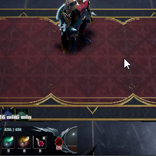

#### V Rising - Client Plugin

# HideInterface

### Description

Toggle the game interface with F11 key, now with an configuration file to set your own custom key!

### Features
🗒️ Configurable

⚙️ Hot reloading

### Screenshots

### Installation
- Install [BepInExPack V Rising](https://v-rising.thunderstore.io/package/BepInEx/BepInExPack_V_Rising/)
- **IMPORTANT** If you have already installed HideInterface, please delete all the files you already have
- Extract ``me.arwent.HideInterface`` folder into _(VRising folder)/BepInEx/plugins_

### Configuration
- Open ``me.arwent.HideInterface.Configuration.xml`` with your favorite text editor
- Edit what you wish
- Save and let the plugin hot reload your file without needing to restart your game

### Support
- [V Rising Mod Community](https://discord.gg/CWzkHvekg3) and ping `@Arwent#6190`

### Changelog
`1.1.0` Added a configuration file for custom key and if you wish to hide the version watermark at the bottom right of the game

`1.0.0` First release